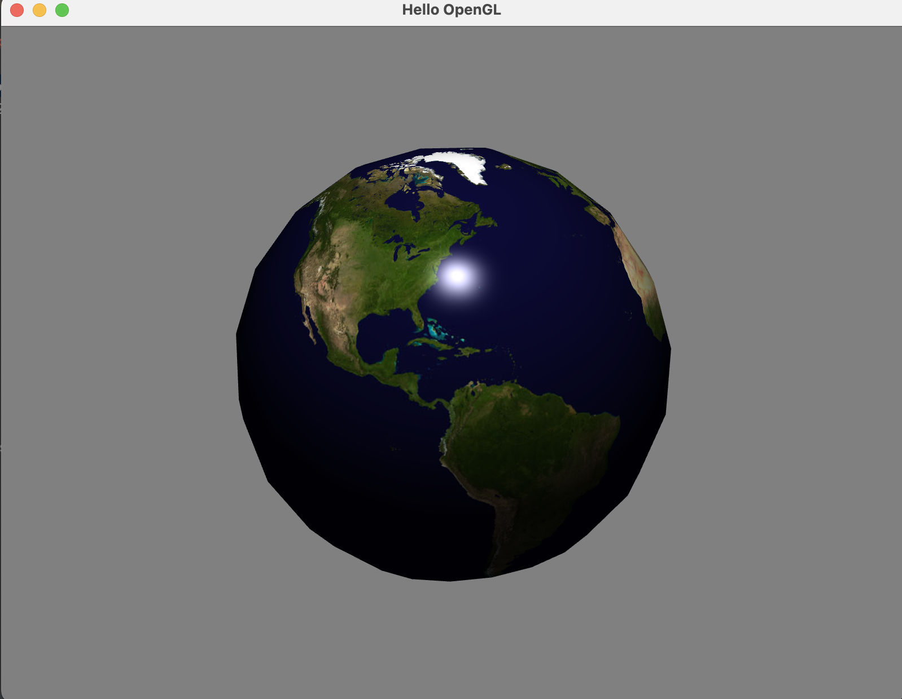
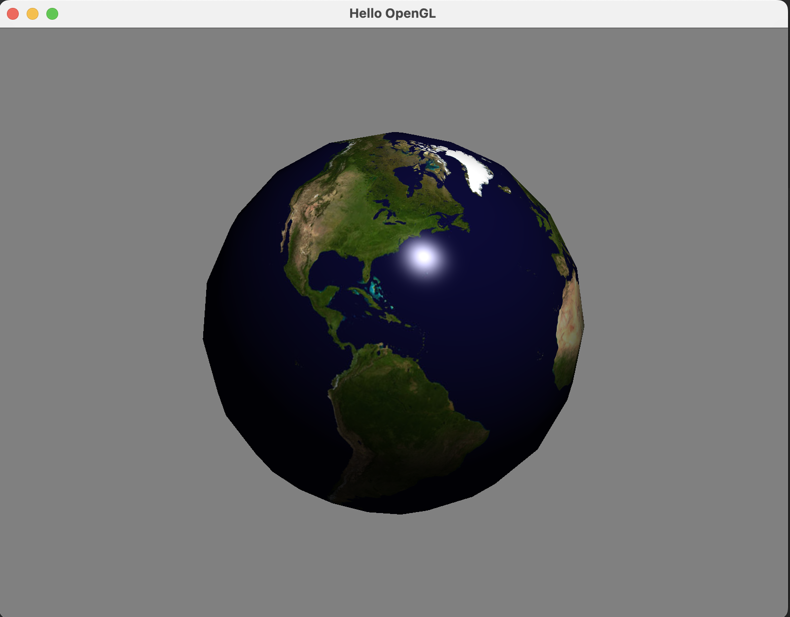
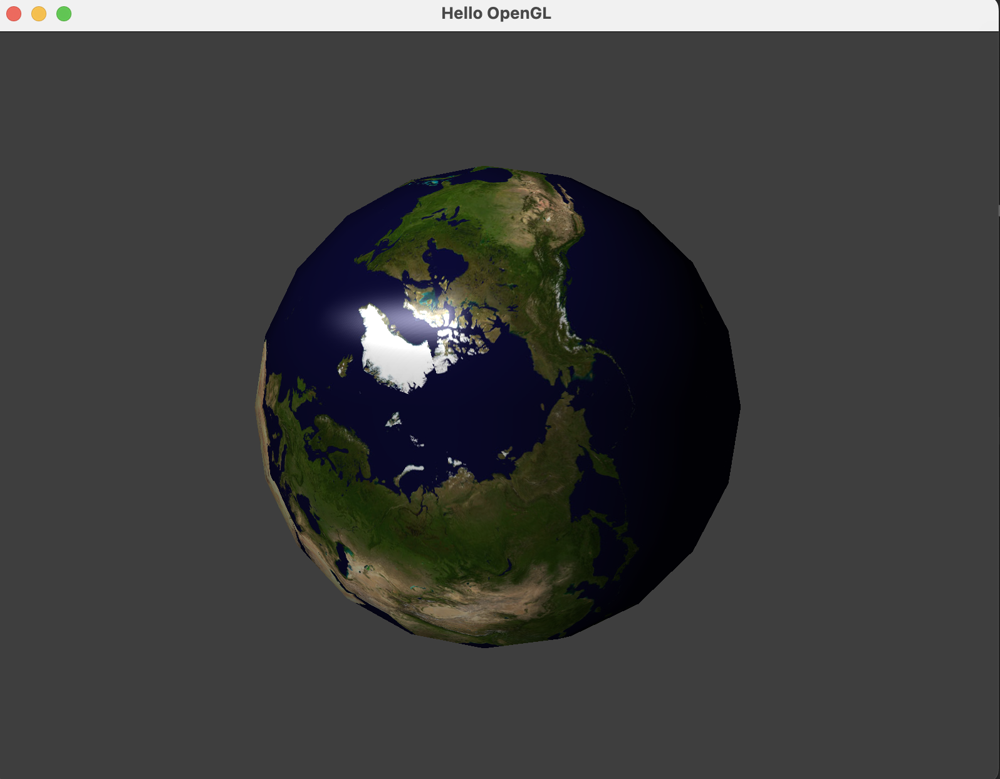
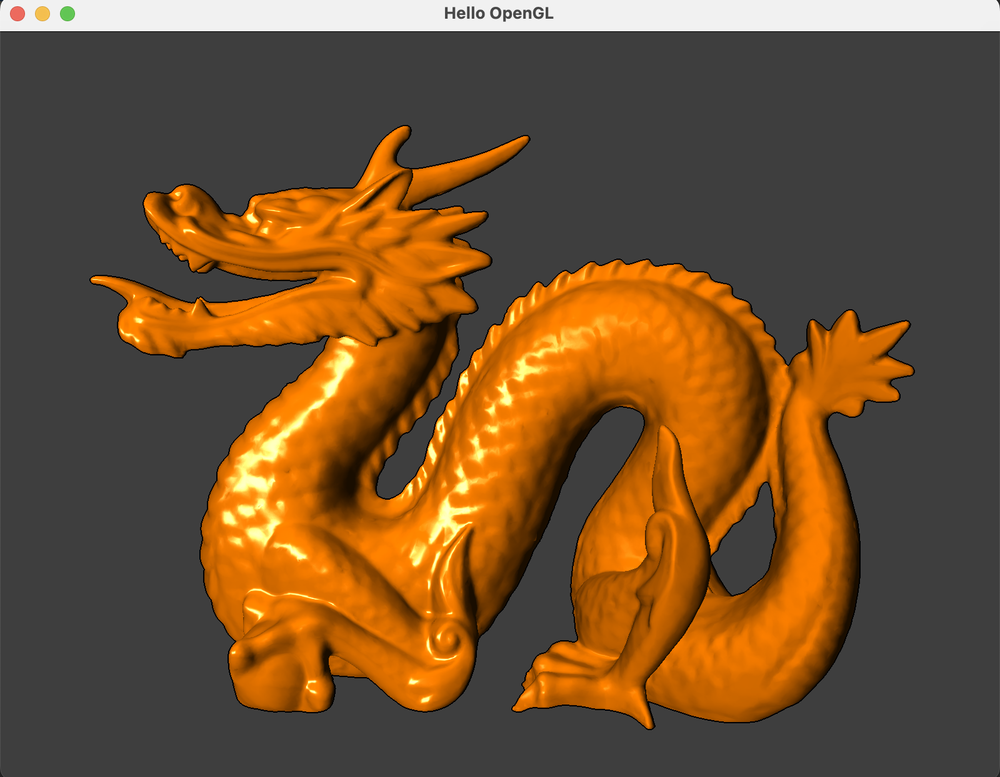

# CS-GY 6533 A / CS-UY 4533 - Interactive Computer Graphics - Fall 2022

# Assignment 4: OpenGL Textures & Deferred Shading by Hao Wu(hw2280@nyu.edu)

### Mandatory Tasks

#### (1) Texturing a sphere

Extend the sphere rendering so that the sphere is textured with the provided NASA Blue Marble earth image:

#### (2) Render-to-Texture

Generate a texture that has the size of the viewport and bind it to a framebuffer object. Render the globe scene to this framebuffer object. After unbinding the framebuffer object, render the texture to a quad, i.e., two triangles forming a rectangle that fills the entire screen.

#### (3) Deferred Shading

#### (4) Outlines

